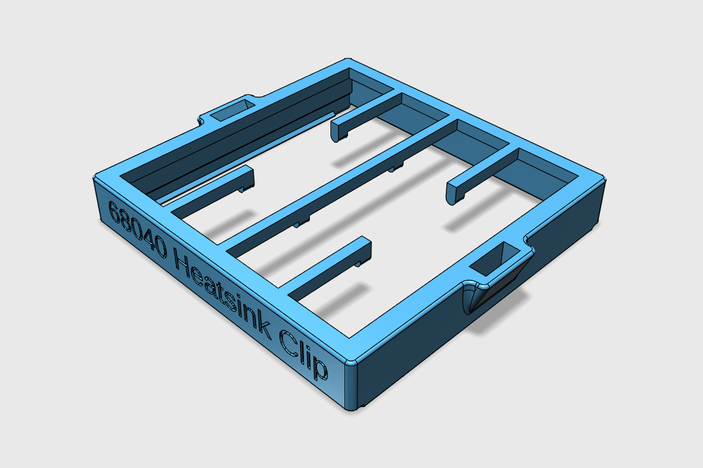
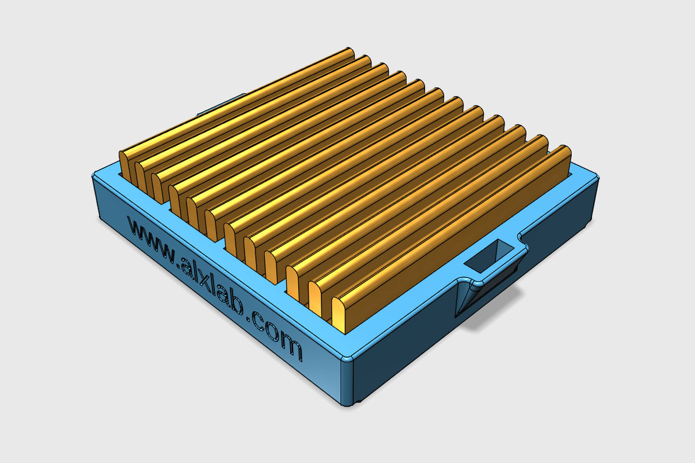

[alxlab GitHub Repositories](https://github.com/alxlab-zone66x?tab=repositories)

# 68040 Heatsink Clip

This is a 3D printable heatsink clip for a 45mm x 45mm x 10mm aluminum heatsink to attach it to a 68040 present on many Macintosh computers.

I will also be making a modified version of the clip to allow attaching a fan. 

## Printing Notes

This can be printed without supports. On an FDM 3D printer this should be printed with enough outer shells to make it 100% solid.

## Pictures

## License

<a property="dct:title"  rel="cc:attributionURL"  href="https://github.com/alxlab-zone66x/68040_Heatsink_Clip">68040 Heatsink Clip</a> by <a rel="cc:attributionURL  dct:creator" property="cc:attributionName"  href="https://www.alxlab.com">Alexandre Marcoux</a> is licensed  under <a  href="http://creativecommons.org/licenses/by-nc-sa/4.0/?ref=chooser-v1"  target="_blank" rel="license noopener noreferrer"  style="display:inline-block;">CC BY-NC-SA 4.0</a>
  

## Community

For more great retro hardware projects and a great community check out:

Join us in #skunkworks on [Discord](https://discord.gg/GKcvtgU7P9) to help make retro solutions available to all.

